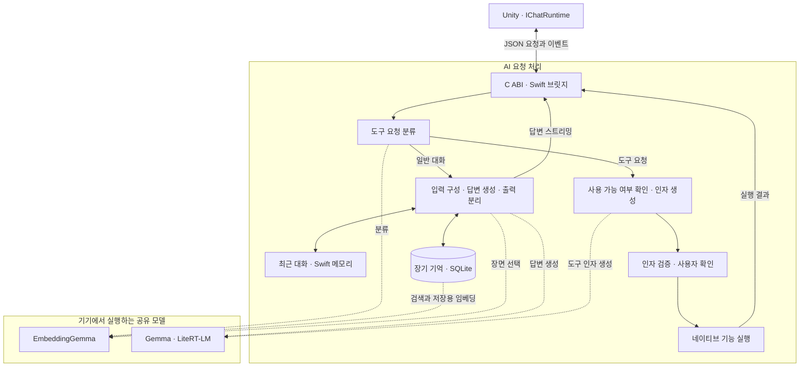
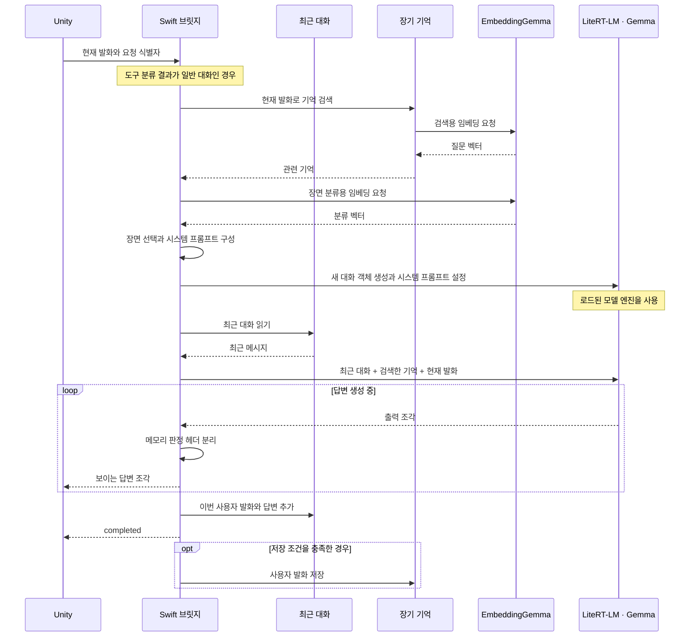

PetAI의 AI 기능은 Unity가 보낸 요청을 iOS의 Swift 코드에서 처리합니다. Swift 브릿지는 요청을 일반 대화와 기기 기능 호출로 나누고, 모델 실행에 필요한 입력을 구성합니다. 대화 답변은 생성되는 동안 Unity에 전달하며, 기기 기능 호출은 인자 검증과 사용자 확인을 거쳐 실행합니다.

## System overview

Unity는 입력과 세션 정보를 전달하고 결과 이벤트를 받습니다. Swift는 요청의 처리 순서를 조율하며, Gemma와 EmbeddingGemma를 기기에서 실행합니다. Gemma는 답변과 도구 호출에 필요한 인자를 생성합니다. EmbeddingGemma는 메모리 검색, 장면 선택, 도구 분류에 사용할 벡터를 만듭니다.

아래 그림의 실선은 요청과 데이터의 전달 관계를, 점선은 공유 모델의 사용 관계를 나타냅니다.

검색과 분류는 같은 임베딩 서비스를 사용하지만, 입력 형식과 벡터를 이용하는 방법이 다릅니다. 메모리 검색은 현재 질문과 저장된 발화의 유사도를 비교합니다. 장면 선택과 도구 분류는 분류용 입력 형식으로 만든 벡터를 각 라우터에 전달합니다.

Gemma의 모델 엔진도 대화와 도구 인자 생성에서 함께 사용합니다. 두 작업은 서로 다른 지침과 대화 객체를 사용하며, 각 경로가 출력을 해석하는 방식도 다릅니다.

## Unity bridge

Unity 쪽 접점은 `IChatRuntime`입니다. 초기화, 요청 전송, 취소와 모델 해제 기능을 제공하며, 결과는 이벤트 큐에서 읽습니다. iOS 빌드에서는 네이티브 구현을 사용합니다.

요청에는 식별자, 입력 문장, 생성 옵션과 세션 정보가 들어갑니다. Unity가 이 값을 JSON으로 직렬화해 C 함수를 호출하면, Objective-C++ 래퍼가 Swift 함수로 연결합니다. Swift는 요청 형식과 런타임 상태를 확인한 뒤 처리를 시작합니다. 이 통신은 앱 내부에서 이루어집니다.

응답도 JSON 이벤트로 돌아옵니다. Swift가 콜백을 호출하면 Unity 어댑터가 이벤트를 큐에 넣고, Unity의 대화 세션이 큐를 읽어 상태와 답변을 갱신합니다.

| 이벤트 | 전달하는 내용 |
| --- | --- |
| `model_required`, `loading`, `ready` | 모델 준비 상태를 알립니다. |
| `generating` | 요청 처리를 시작했음을 알립니다. |
| `token` | 화면에 표시할 답변 조각을 전달합니다. |
| `completed` | 요청의 답변 처리가 끝났음을 알립니다. |
| `cancelled`, `error` | 취소 또는 실패를 알립니다. 오류에는 코드와 설명이 포함됩니다. |

요청에 속한 이벤트에는 요청 식별자가 붙습니다. Unity는 이 식별자가 현재 요청과 일치하는지 확인합니다. 이미 끝난 요청이나 다른 요청의 답변 조각이 뒤늦게 도착하면 현재 답변에 붙이지 않습니다. `token` 이벤트의 텍스트 길이는 모델 토큰 한 개와 일치할 필요가 없습니다.

## Conversation pipeline

일반 대화 경로는 장면별 지침 선택이 켜진 현재 설정에서, 도구 호출로 분기하지 않은 요청을 처리합니다. 브릿지는 세션 정보를 보완하고 장기 기억을 검색한 뒤, 이번 답변에 사용할 장면 지침을 선택합니다. 여기서 장면은 발화에 맞는 응답 지침의 분류를 뜻합니다.

시스템 프롬프트에는 공통 응답 지침, 선택한 장면 지침, 세션 정보와 메모리 판정 형식이 들어갑니다. 최근 대화와 검색한 기억은 현재 발화와 함께 별도의 입력으로 구성합니다.

| 입력 | 보관 위치와 사용 방식 |
| --- | --- |
| 최근 대화 | Swift 메모리에 최근 20개 메시지, 즉 최대 10회의 사용자·답변 쌍을 보관합니다. 다음 요청에 이 기록을 함께 넣습니다. |
| 장기 기억 | SQLite에 저장된 발화 중 현재 질문과 관련 있는 기록을 검색해 넣습니다. |
| 현재 발화 | 이번 요청으로 들어온 사용자 입력입니다. |

Swift는 요청마다 시스템 프롬프트를 설정한 새 대화 객체를 만듭니다. 이때 이미 로드한 모델 엔진은 계속 사용합니다. 최근 대화가 다음 요청에도 이어지는 이유는 Swift가 보관한 기록을 다시 입력에 넣기 때문입니다.

Gemma는 대화 답변과 함께 `save(P=X,E=Y)` 형식의 저장 판정값을 출력합니다. Swift가 이 헤더를 분리하고, 사용자에게 보여 줄 답변만 Unity로 전달합니다. 판정값만 나오고 답변이 비어 있으면 답변 생성만 한 번 다시 시도합니다.

답변을 완성하면 이번 발화와 답변을 최근 대화에 추가하고 `completed` 이벤트를 보냅니다. 그 뒤 저장 조건을 충족한 사용자 발화를 장기 기억에 기록합니다. 따라서 `completed`는 기억 저장까지 성공했다는 신호는 아닙니다. 저장이 실패해도 이미 생성한 답변은 유지됩니다.

저장 판정 기준은 [What gets saved](https://pysunn.me/docs-beolmuri-ai/?doc=memory-save), 검색과 모델 입력의 구성은 [How memories are retrieved](https://pysunn.me/docs-beolmuri-ai/?doc=memory-retrieval)에서 설명합니다.

## Tool pipeline

기기 기능이 필요한 요청은 일반 대화 입력을 구성하기 전에 분기합니다. 먼저 발화의 임베딩 벡터를 MLP에 넣어 도구 호출 후보인지 판단합니다. 후보로 분류한 발화는 임베딩 유사도로 도구를 선택합니다. 도구를 하나로 정하지 못하거나 사용할 수 없는 기능이면 안내를 반환합니다.

실행 가능한 도구를 선택하면 Gemma에 해당 도구의 인자를 요청합니다. 이때 선택한 도구의 정의와 전용 지침을 넣은 대화 객체를 사용합니다. 모델이 반환한 도구 호출은 파싱과 인자 검증을 거칩니다.

검증한 제안은 사용자 확인 화면으로 전달합니다. 사용자가 내용을 수정했다면 수정한 인자를 다시 검증합니다. 승인한 요청은 실행 상태를 관리하는 코드를 거쳐 네이티브 기능 어댑터로 전달하고, 어댑터의 실행 결과를 정해진 응답 형식으로 Unity에 반환합니다.

이 과정에는 일반 대화의 장기 기억 검색과 저장이 들어가지 않습니다. 사용자에게 보여 준 도구 응답은 최근 대화 기록에는 남을 수 있으므로, 다음 일반 대화에서 앞선 요청의 문맥으로 사용할 수 있습니다.

## Runtime lifecycle

대화를 시작하려면 언어 모델, 임베딩 모델과 토크나이저가 준비되어 있어야 합니다. 브릿지는 설치된 자산의 위치와 프롬프트·라우터 자원을 확인하고, 언어 모델과 임베딩 서비스를 준비합니다. 준비가 끝나면 Unity에 `ready` 이벤트를 보냅니다. 요청을 받을 준비가 되지 않은 상태에서는 준비 필요 또는 오류 이벤트를 반환합니다.

현재 iOS 생성 런타임은 LiteRT-LM의 CPU 백엔드로 설정되어 있습니다. Unity 빌드와 실험용 iOS 앱은 런타임, 임베딩과 메모리 서비스의 일부 Swift 구현을 함께 사용합니다.

실패한 단계에 따라 후속 처리도 달라집니다.

| 상황 | 처리 |
| --- | --- |
| 메모리 검색 실패 | 오류를 기록하고 검색한 기억 없이 대화를 계속합니다. |
| 장면 라우팅 실패 | `GENERAL` 분류로 진행합니다. |
| 도구 라우터 자원 또는 분류 오류 | 도구 실행을 진행하지 않고 일반 대화 경로로 보냅니다. |
| 메모리 판정 헤더가 없거나 잘못됨 | 해당 발화를 장기 기억에 저장하지 않습니다. |
| 답변 재시도 이후에도 본문이 없음 | 오류를 반환하고 기억을 저장하지 않습니다. |
| 답변 이후 기억 저장 실패 | 생성한 답변을 유지하고 저장 오류를 기록합니다. |

일반 대화 스트리밍은 현재 생성 작업을 추적해 취소를 요청합니다. 취소가 정해진 시간 안에 끝나지 않으면 런타임을 실패 상태로 바꾸고 오류를 반환합니다. 모델을 해제할 때는 메모리 서비스를 닫고 최근 대화 기록도 비웁니다.

도구 인자를 생성하는 경로는 일반 스트리밍과 취소 작업을 등록하는 방식이 다릅니다. 인자 생성 중 취소가 실제 생성 중단과 이후 확인 화면까지 어떻게 이어지는지는 추가 검증이 필요합니다.

## Implementation status

현재 코드에는 Unity의 요청·이벤트 연결, 장면별 입력 구성, 메모리 검색과 저장, 도구 인자 생성과 확인 절차가 연결되어 있습니다. 저장소의 단위 테스트는 요청 식별자 처리, 최근 대화 길이 제한, 메모리 헤더 분리와 도구 인자 검증 등을 다룹니다.

도구 라우팅 후보는 아직 독립적인 평가와 아이폰에서의 전체 실행 검증이 필요합니다. Mac에서 얻은 분류 점수나 생성 시간만으로 아이폰의 지연시간, 메모리 사용량과 연속 사용 시 동작을 판단할 수는 없습니다. 이 문서는 현재 코드의 구성과 처리 순서를 설명하며, 기기 성능 수치는 해당 조건에서 측정한 평가 문서에서 다룹니다.
