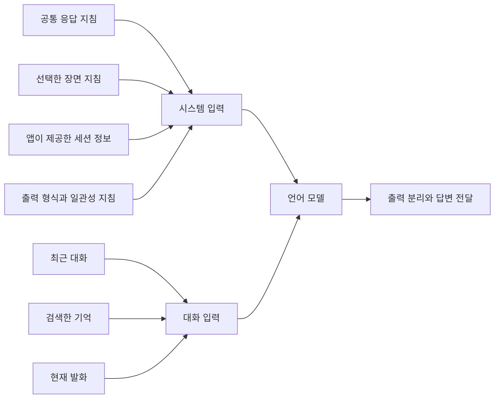

대화 답변을 만들 때는 현재 문장뿐 아니라 앞선 대화, 검색한 기억과 응답 지침도 필요합니다. 이 정보가 모델에 들어가는 위치와 순서를 정하는 코드가 입력 구성부입니다.

현재 구현은 응답 방식을 정하는 시스템 입력과, 이번에 답할 내용을 제공하는 대화 입력을 구성합니다.

## Input structure

공통 지침은 여러 요청에 공통으로 적용합니다. 장면 지침은 현재 발화의 분류 결과에 따라 하나를 선택합니다. 앱이 제공하는 세션 정보와 출력 형식에 관한 지침도 시스템 입력에 함께 들어갑니다.

최근 대화는 Swift가 보관합니다. 현재 설정은 사용자 메시지와 답변을 각각 한 개로 세어 최대 20개 메시지를 유지합니다. 정상적으로 사용자·답변 쌍을 추가하면 최대 10회의 대화가 남습니다. 앞선 답변에는 사용자에게 실제 표시한 텍스트를 사용합니다.

검색한 기억은 현재 발화와 함께 구성합니다. 최근 대화가 순서에 따라 보관되는 것과 달리, 장기 기억은 현재 질문과의 관련성을 기준으로 선택합니다. 두 입력은 답변에 필요한 서로 다른 범위의 문맥을 제공합니다.

## Conversation lifetime

장면별 지침을 사용하는 현재 대화 경로에서는 요청마다 새 대화 객체를 만듭니다. 이때 공통 지침과 선택한 장면 지침을 다시 조합합니다. 모델 파일을 매번 다시 로드하는 것은 아니며, 이미 준비한 엔진에서 대화 객체를 생성합니다.

이 구조에서는 다음 답변에 사용할 이력을 Swift가 명시적으로 구성할 수 있습니다. 반면, 유지한 최근 대화를 다음 요청의 입력으로 다시 처리해야 합니다. 이력이 길어질수록 입력 처리 비용이 어떻게 달라지는지는 같은 기기에서 측정해야 합니다.

최근 대화의 제한은 메시지 개수 기준입니다. 긴 메시지 한 개와 짧은 메시지 한 개를 같은 한 개로 셉니다. 따라서 20개라는 제한만으로 전체 입력의 토큰 수가 일정하게 제한되는 것은 아닙니다.

## Output handling

일반 대화의 모델 출력에는 기억 저장 여부를 나타내는 제어 부분과 사용자에게 보여 줄 답변이 함께 들어옵니다. Swift는 스트리밍 조각을 모아 제어 부분을 판독하고, 표시할 답변을 Unity로 전달합니다.

답변 본문이 비어 있으면 답변 생성을 한 번 더 시도합니다. 이때 처음 출력의 저장 판정과 재시도에서 얻은 표시할 답변을 구분합니다. 재시도에서도 본문이 없으면 오류로 처리합니다.

완성된 사용자·답변 쌍은 최근 대화에 추가됩니다. 장기 기억 저장 여부는 별도 조건으로 결정하므로, 최근 대화에 들어간 모든 메시지가 장기 기억에 기록되는 것은 아닙니다.

## Configuration and quality

대화 설정에는 공통 지침과 장면 지침의 포함 여부, 세션 정보의 포함 여부, 정체성 유지 지침과 기억 판정의 사용 여부가 나뉘어 있습니다. 제품은 사용할 설정을 명시하고, 평가 실행부는 이 항목을 바꿔 비교할 수 있습니다.

다만 기억 판정을 끄는 실험은 지침 일부를 빼는 것보다 변경 범위가 넓습니다. 해당 설정은 저장 판정 해석과 전용 재시도 경로도 함께 바꿉니다. 결과가 달라졌다면 지침의 효과와 출력 처리의 효과를 함께 고려해야 합니다.
