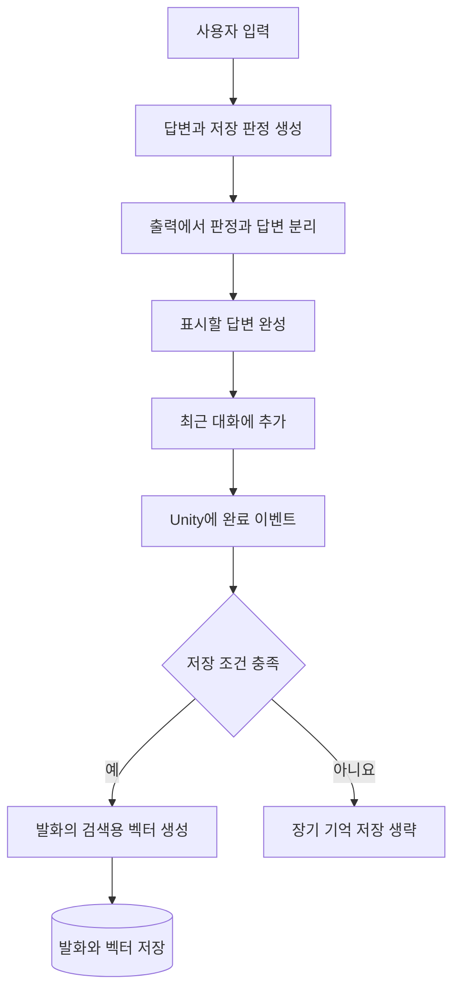

별무리의 대화 입력에는 최근 대화와 검색한 장기 기억이 함께 들어갑니다. 두 정보는 보관 장소와 선택 기준이 다릅니다. 최근 대화는 순서대로 이어지는 문맥을 제공하고, 장기 기억은 이전에 저장한 발화 중 현재 질문과 관련 있는 내용을 제공합니다.

## Two kinds of context

| 구분 | 최근 대화 | 장기 기억 |
| --- | --- | --- |
| 보관 위치 | Swift에서 관리하고 기기 내 파일에 보존합니다. | SQLite에 기록합니다. |
| 포함 대상 | 최근 사용자 메시지와 표시한 답변을 유지합니다. | 저장 판정을 통과한 사용자 발화를 기록합니다. |
| 선택 기준 | 최근 메시지부터 제한 개수만 유지합니다. | 현재 질문과 벡터 유사도를 비교합니다. |
| 기본 제한 | 앱에 설정된 최근 대화 보관 범위를 적용합니다. | 검색 결과는 최대 10개이며 입력 토큰 예산도 적용합니다. |
| 모델 해제 시 | 메모리의 세션 상태를 비우며 저장된 이력은 다음 초기화에서 복원합니다. | 서비스 연결을 닫으며 저장 파일과는 수명을 구분합니다. |

최근 대화가 길어져 오래된 메시지가 제외되어도, 해당 발화가 장기 기억에 저장되어 있다면 나중에 검색될 수 있습니다. 반대로 장기 기억에 저장되지 않은 발화는 최근 대화 범위에서 벗어난 뒤 검색 대상이 되지 않습니다.

## Write path

저장 판정은 사용자 발화가 지속적인 특성에 해당하는지, 사건에 해당하는지를 분류합니다. Swift는 출력 형식이 유효한지와 표시할 답변이 존재하는지를 확인합니다. 판정이 없거나 해석할 수 없으면 장기 기억 저장을 진행하지 않습니다.

같은 요청에서 저장을 중복으로 시도하지 않도록 요청 식별자를 기록하는 방어 코드가 있습니다. 이 기록은 메모리에 존재하므로, 그것만으로 앱 재실행을 포함한 모든 상황의 중복 방지가 증명되는 것은 아닙니다.

현재 경로에서 저장하는 대상은 사용자가 보낸 발화입니다. 모든 대화를 요약해 하나의 최신 프로필로 덮어쓰는 구조는 아닙니다. 도구 경로는 일반 대화의 장기 기억 저장 절차를 거치지 않습니다.

## Read path

현재 질문을 검색용 벡터로 바꾼 뒤, 저장소에서 해당 검색 범위와 임베딩 모델에 맞는 활성 기록을 읽습니다. 검색기는 후보 벡터를 하나씩 비교해 코사인 유사도를 계산합니다. 현재 구현에는 이 단계에서 근사 검색 인덱스를 사용하는 경로가 없습니다.

유사도가 하한을 넘은 후보를 높은 점수부터 정렬합니다. 점수가 같으면 발생 시간이 최근인 기록을 먼저 두고, 그 값도 같으면 식별자로 순서를 결정합니다. 텍스트의 공백과 유니코드 표현을 정규화해 같은 내용의 중복 후보를 제거한 뒤 상위 결과를 가져옵니다.

현재 기본값은 유사도 하한 0.3과 최대 10개 결과입니다. 이 숫자는 제품 설정에 들어 있는 값이며, 모든 데이터에서 최적인 검색 기준이라는 뜻은 아닙니다.

## Input budget

검색 결과가 10개여도 전부 모델 입력에 들어가지는 않을 수 있습니다. 일반 대화의 입력 구성부는 네이티브 토크나이저로 기억의 길이를 측정하며, 기본 예산은 2,048토큰입니다. 전체 입력은 출력 공간을 예약한 컨텍스트 한도 안에 들어가야 합니다.

긴 항목 하나가 남은 예산을 넘으면 그 항목을 건너뛰고 다음 항목을 확인합니다. 본문을 중간에서 잘라 넣는 방식과는 다릅니다. 이 예산은 기억 문장 부분에 적용되며, 시스템 지침과 최근 대화까지 합친 전체 모델 입력의 한도를 뜻하지 않습니다.

## Limits of retrieval

유사한 문장을 찾았다는 사실만으로 그 문장이 현재 유효한 정보라고 판단할 수는 없습니다. 현재 검색기는 의미 유사도를 우선하고, 시간은 점수가 같을 때 순서를 정하는 데 사용합니다. 의미가 비슷한 옛 기록이 더 높은 점수를 받으면 최신 기록보다 먼저 선택될 수 있습니다.

모델 입력에는 기억의 원문 텍스트가 들어가지만, 각 기록의 발생 시각은 함께 전달되지 않습니다. 시간에 따라 달라진 상태를 정확히 답하려면 검색 결과의 유효 시점과 서로 충돌하는 기록을 다루는 추가 설계가 필요합니다.
