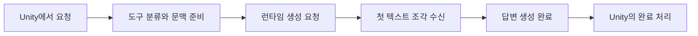

대화 요청의 대기시간에는 기억 검색, 장면 분류, 모델 입력 처리와 답변 생성이 포함됩니다. 답변 생성 시간만 줄여도 전체 대기시간이 같은 비율로 줄어드는 것은 아닙니다. 어느 단계의 시간을 재고 있는지 먼저 확인해야 합니다.

현재 코드에는 토큰 예산 검사, 캐시 세션 재사용과 단계별 시간 기록이 있습니다.

## Input Budget

일반 대화는 네이티브 토크나이저로 기억의 길이와 템플릿이 적용된 전체 입력을 측정합니다. 기본 설정은 다음과 같습니다.

| 설정 | 기본값 | 적용 범위 |
| --- | --- | --- |
| 컨텍스트 용량 | 4,096토큰 | 입력과 생성 출력의 전체 한도 |
| 출력 예약 | 1,024토큰 | 생성 전에 확보하는 출력 공간 |
| 기억 입력 예산 | 2,048토큰 | 검색한 기억에서 입력에 포함할 부분 |

전체 입력은 컨텍스트 용량에서 출력 예약을 뺀 범위를 넘을 수 없습니다. 기억 예산을 만족해도 지침과 최근 대화를 합친 입력이 이 한도를 넘으면 생성 전에 오류를 반환합니다. 각 절을 따로 센 토큰 수는 템플릿을 적용한 전체 토큰 수와 단순 합산으로 같아지지 않을 수 있습니다.

## Session Reuse

런타임은 모델 엔진과 호환되는 대화 세션을 유지합니다. 요청마다 전체 입력을 다시 구성하고 처리 위치를 되돌린 뒤, 동일한 토큰 접두부의 KV를 재사용합니다. 샘플링 설정이나 출력 상한이 달라지면 세션을 새로 만듭니다.

완료된 대화의 상태는 체크포인트로 저장할 수 있습니다. 저장과 복원 비용까지 포함해 성능을 비교해야 하며, 동작과 검증 결과는 [KV Cache Reuse and Persistence](?doc=optimization-kv-cache)에서 설명합니다.

## Timing boundaries

현재 iOS 런타임의 첫 조각 시간 로그는 생성 요청 시점부터 첫 텍스트 조각을 받을 때까지 측정합니다. 그 전에 수행한 도구 분류, 기억 검색과 장면 선택 시간은 이 구간에 포함되지 않습니다.

또한 첫 출력에 기억 저장 판정이 포함되면, 그 조각이 곧바로 사용자에게 보이는 답변은 아닐 수 있습니다. 출력 분리 이후 실제로 표시할 텍스트가 Unity에 도달하는 시점까지 확인해야 사용자가 느끼는 첫 응답 시간을 설명할 수 있습니다.

생성 완료 로그에는 경과 시간, 조각 수와 문자 수가 기록됩니다. 스트리밍 조각 수는 모델 토큰 수와 같지 않으므로, 조각 수를 시간으로 나누어 토큰 생성 속도로 보고하면 안 됩니다.
