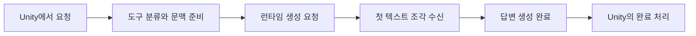

대화 요청의 대기시간에는 기억 검색, 장면 분류, 모델 입력 처리와 답변 생성이 포함됩니다. 답변 생성 시간만 줄여도 전체 대기시간이 같은 비율로 줄어드는 것은 아닙니다. 어느 단계의 시간을 재고 있는지 먼저 확인해야 합니다.

현재 코드에는 입력 개수와 길이를 제한하는 설정, 모델 엔진 재사용, 단계별 시간 기록이 있습니다.

## Input limits

| 설정 | 현재 값 | 실제로 제한하는 범위 |
| --- | --- | --- |
| 최근 대화 | 최대 20개 메시지 | 사용자 메시지와 답변의 개수를 제한합니다. |
| 장기 기억 검색 | 최대 10개 | 유사도 하한과 중복 제거를 거친 검색 결과 수를 제한합니다. |
| 기억 입력 예산 | 10,000 UTF-8 바이트 | 입력에 포함할 기억 문장들의 바이트 수를 제한합니다. |
| 생성 출력 | 최대 4,096토큰 | 런타임에 전달하는 출력 토큰 상한입니다. |

토큰은 모델이 텍스트를 처리할 때 사용하는 단위입니다. 한 글자나 한 단어와 항상 같지는 않습니다. UTF-8 바이트는 파일과 문자열을 표현하는 크기 단위이므로 토큰과도 다릅니다.

기억 입력 예산은 정확한 토큰 수를 세는 구현이 아닙니다. 최근 대화 제한도 메시지 개수 기준입니다. 따라서 두 제한을 적용해도 전체 시스템 입력과 대화 입력이 항상 특정 토큰 수 이하가 된다고 보장할 수는 없습니다.

## Engine reuse

모델 엔진은 준비한 뒤 여러 요청에서 재사용합니다. 장면별 지침을 사용하는 일반 대화는 새 요청마다 대화 객체를 만들고 최근 대화를 입력에 다시 넣습니다. 엔진을 재사용하는 것과 이전 대화의 내부 캐시를 요청 사이에 계속 유지하는 것은 다른 동작입니다.

이 구조에서 입력을 줄이면 이전 메시지나 기억에 담긴 정보가 빠질 수 있습니다. 최근 대화의 개수, 기억 검색 개수와 기억 길이 예산을 바꾸는 실험은 시간뿐 아니라 답변 품질도 함께 비교해야 합니다.

## Timing boundaries

현재 iOS 런타임의 첫 조각 시간 로그는 생성 요청 시점부터 첫 텍스트 조각을 받을 때까지 측정합니다. 그 전에 수행한 도구 분류, 기억 검색과 장면 선택 시간은 이 구간에 포함되지 않습니다.

또한 첫 출력에 기억 저장 판정이 포함되면, 그 조각이 곧바로 사용자에게 보이는 답변은 아닐 수 있습니다. 출력 분리 이후 실제로 표시할 텍스트가 Unity에 도달하는 시점까지 확인해야 사용자가 느끼는 첫 응답 시간을 설명할 수 있습니다.

생성 완료 로그에는 경과 시간, 조각 수와 문자 수가 기록됩니다. 스트리밍 조각 수는 모델 토큰 수와 같지 않으므로, 조각 수를 시간으로 나누어 토큰 생성 속도로 보고하면 안 됩니다.
