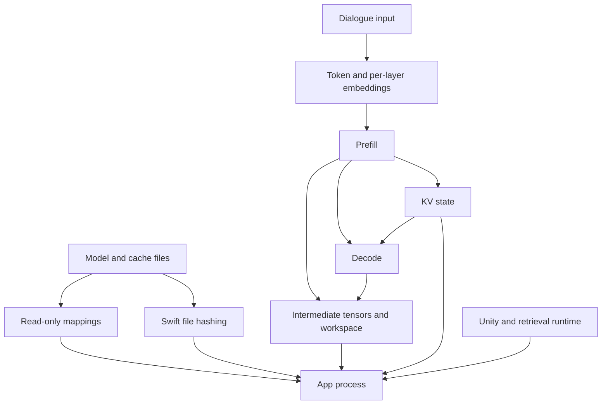

별무리는 Unity 앱 안에서 LiteRT-LM의 CPU 경로로 Gemma 모바일 양자화 모델을 돌립니다. 모델을 준비하는 동안 가중치 매핑과 검색용 임베딩 모델이 올라옵니다. 대화 입력을 처리하는 프리필 단계에서는 중간 텐서와 작업 공간이 추가로 필요합니다. Unity의 렌더링 자산과 앱 데이터도 계속 메모리에 남아 있습니다.

실측으로 메모리 절감을 확인한 변경은 세 가지입니다. XNNPACK의 스케일 배열 크기 계산 수정, 프리필을 128토큰 단위로 처리하는 조건의 비교, Swift 파일 해시 계산에서 임시 읽기 버퍼가 쌓이던 문제의 수정입니다. 순서대로 엔진의 보조 배열, 추론 작업 공간, 앱 준비 단계의 파일 처리에 해당합니다.

2026년 10월 8일까지의 기록을 기준으로, E2B 실앱의 4K·청크 128·긴 입력은 XNNPACK 수정 전후에 **RSS 2.892→2.499GiB, 풋프린트 1.680→1.118GiB**였습니다. E4B는 수정 후 4K·청크 128에서 같은 입력을 끝까지 처리했고 **RSS 3.152GiB, 풋프린트 1.315GiB**였습니다. 값은 새 앱 실행 3회의 최고값 중앙값입니다. 8K 결과와 실패한 조건도 아래 표에 같이 적었습니다.

## Reading the measurements

| 지표 | 측정하는 대상 | 쓰임 |
| --- | --- | --- |
| 모델 파일 크기 | 저장 장치에 있는 배포 파일의 바이트 | 다운로드·설치 공간과 파일 구성을 봅니다. |
| RSS | 프로세스가 매핑한 페이지 중 지금 물리 메모리에 올라와 있는 양 | 가중치의 읽기 전용 페이지까지 포함한 상주 규모를 봅니다. |
| `phys_footprint` | 운영체제가 프로세스에 부과하는 메모리 사용량 | iOS 앱의 메모리 한도와 대조합니다. 더티 메모리와 압축된 메모리 등이 들어갑니다. |
| 로드 전 대비 증가량 | 같은 프로세스의 최고값에서 모델 로드 전 값을 뺀 차이 | 엔진 초기화와 추론이 더한 부담입니다. 런타임 버퍼도 들어갑니다. |
| KV 텐서의 논리 크기 | 텐서 형상과 자료형으로 계산한 바이트 | 모델 구조끼리 비교할 때 씁니다. 실제 사본 수와 상주량은 따로 측정해야 합니다. |
| 개별 할당 요청 | `malloc`·`mmap` 등이 요청한 영역의 크기 | 어느 버퍼를 잡다가 실패했는지 추적합니다. |
| 기기 전체 VM 통계 | 빈 페이지·파일 기반 페이지·압축 메모리 등 | 다른 프로세스가 함께 돌아가는 기기의 상태를 봅니다. |

RSS와 풋프린트는 같은 프로세스를 서로 다른 기준으로 센 값입니다. 가중치 캐시의 읽기 전용 페이지는 RSS에는 잡히지만 풋프린트에는 거의 반영되지 않을 수 있습니다. 운영체제는 이런 파일 페이지를 회수했다가 필요할 때 다시 읽습니다. 더티 페이지는 압축될 수 있고, 압축된 메모리는 풋프린트에 반영됩니다. 두 값을 더해서 앱 사용량으로 쓰면 안 됩니다. [Apple의 메모리 회계 설명](https://developer.apple.com/videos/play/wwdc2018/416/)

표의 GiB는 $2^{30}$바이트, MiB는 $2^{20}$바이트입니다. 따로 적지 않았다면 값은 실행별 프로세스 전체 최고값의 중앙값입니다. RSS와 풋프린트가 최고에 이른 시점은 서로 다를 수 있습니다. 실패한 행은 중단 직전까지 모은 값이고, 수집하지 못한 항목은 `미수집`으로 적었습니다.

## Where memory is allocated

LiteRT-LM은 모델을 읽고 프리필과 디코드를 실행하는 런타임입니다. CPU 연산 중 지원되는 부분은 XNNPACK이 맡습니다. XNNPACK은 행렬곱과 양자화 연산을 실행하고, 커널이 읽기 좋은 형태로 가중치를 재배치하면서 작업 공간도 준비합니다.

메모리 피크는 버퍼의 크기와 버퍼가 살아 있는 시간으로 정해집니다. 다음 연산이 같은 버퍼를 재사용하면 할당이 늘지 않지만, 이전 버퍼를 둔 채 더 큰 영역을 새로 잡으면 교체하는 순간에 사용량이 올라갑니다. 그래서 모델 파일 크기와 그래프의 텐서 크기를 전부 더해도 앱 피크는 나오지 않습니다.

### KV state and intermediate tensors

분석한 E2B 모바일 QAT 그래프는 KV 입출력에 이미 INT8을 씁니다. 컨텍스트 크기를 실행 설정값으로 대입하면 KV 입력 한 벌은 4K에서 36MiB, 8K에서 72MiB입니다. 그래프에 기록된 형상으로 계산한 값입니다.

| 구성 | 4096토큰 용량 | 8192토큰 용량 | 값의 종류 |
| --- | ---: | ---: | --- |
| INT8 KV 입력 한 벌 | 36MiB | 72MiB | 논리 크기 |
| 해당 KV를 INT4로 바꿀 때의 이상적 절감 | 18MiB | 36MiB | 스케일·변환 비용을 제외한 계산 |
| `prefill_1024`의 대표 FLOAT32 텐서 하나 | 128MiB | 256MiB | `[1,8,1024,context]` 형상 |
| `prefill_128`의 대응 텐서 하나 | 16MiB | 32MiB | `[1,8,128,context]` 형상 |

KV를 압축하려면 지원하는 커널과 저장 형식까지 바꿔야 합니다. 그래서 먼저 KV보다 큰 XNNPACK 보조 배열부터 추적했습니다. 배포 파일에 든 층별 임베더도 텍스트 추론에 쓰이는 구성 요소입니다. 음성·영상 섹션을 덜어 저장 공간을 줄이는 일과 실행 중 RAM을 줄이는 일은 따로 측정합니다.

대화 접두부의 재사용과 디스크 저장·복원은 [KV Cache Reuse and Persistence](https://pysunn.me/docs-beolmuri-ai/?doc=optimization-kv-cache)에서 설명합니다. 오래된 메시지를 빼서 앞부분이 바뀌면 다시 계산할 범위가 넓어집니다. 이 비용은 프리필 작업 공간의 크기와 함께 봅니다.

## XNNPACK scale allocation

처음 눈에 띈 현상은 입력이 128토큰으로 같은데도 컨텍스트 용량을 4096에서 8192로 키우면 메모리가 크게 늘어난다는 점이었습니다. 맥에서 수정 전 상태를 반복 측정하니 로드 전 대비 최고 풋프린트 증가량이 **0.965→2.749GiB**였습니다.

할당 주소를 호출 스택에 연결해 보니 XNNPACK의 `qs8 → qc8` 변환에 큰 배열 9개가 남아 있었습니다. `qs8`은 텐서 단위 스케일을 쓰는 8비트 정수 표현이고, `qc8`은 채널별 스케일을 쓰는 표현입니다. 이 변환은 뒤 연산이 채널별 스케일을 읽을 수 있도록 같은 환산값을 배열에 반복해서 채웁니다.

기존 코드는 이 배열의 배치 크기를 계산할 때 문맥 차원을 중복해서 곱했습니다. 대표 형상에서 컨텍스트가 두 배가 되면 배열 하나가 네 배로 커졌습니다. 이후 XNNPACK 변경에서 채널별 배열에 필요한 배치 크기를 다시 계산하도록 고쳤습니다. [XNNPACK 변경 `c72e2a4`](https://github.com/google/XNNPACK/commit/c72e2a4ae0efb7c648f73835e9a0133e7bf21a23)

| 컨텍스트 | 대표 입력 형상 | 수정 전 요청/개 | 수정 후 요청/개 | 관측한 큰 배열 수 |
| --- | --- | ---: | ---: | ---: |
| 4096 | `[1,1,4096,512]` | 64MiB | 16KiB | 9 |
| 8192 | `[1,1,8192,512]` | 256MiB | 32KiB | 9 |

위 표는 할당 크기 계산을 진단 로그와 맞춰 본 결과입니다. 앱 전체 메모리가 얼마나 줄었는지는 따로 전후 실행으로 쟀습니다. 이 글에서 **수정 전·후**는 고정 XNNPACK `8388bd78`에 이 스케일 계산 변경을 적용했는지를 가리킵니다. 같은 의존성에서 패치만 넣고 뺀 비교입니다.

## Prefill chunk size

분석한 배포 그래프에는 `prefill_128`과 `prefill_1024`가 있습니다. 청크 128 조건에서는 긴 입력을 잘라 작은 그래프를 여러 번 실행합니다. 한 번에 필요한 중간 텐서와 작업 공간은 작아지고, 호출 횟수는 늘어납니다.

맥에서 E4B의 할당을 추적했습니다. 컨텍스트 4096, 합성 입력 1442토큰, 출력 1토큰, CPU 4스레드이며 두 정상 진단 실행 모두 추론을 끝냈습니다.

| 개별 최대 할당 요청 | 청크 128 | 청크 1024 |
| --- | ---: | ---: |
| XNNPACK 작업 공간 | 27,271,200바이트 | 159,391,776바이트 |
| LiteRT 텐서 저장 공간 | 43,647,696바이트 | 349,181,008바이트 |

작은 청크가 속도에 주는 영향은 실행 환경마다 따로 봐야 합니다. 아래 맥 비교에서 E2B 8K 긴 입력의 프리필은 청크 128이 16.031초, 청크 1024가 18.335초였습니다. 아이폰은 모델과 그래프 선택을 맞춘 기기 실측을 씁니다.

### Packed weights and file mappings

XNNPACK은 CPU 커널이 읽기 좋은 형태로 가중치를 재배치해 캐시로 만듭니다. 이 캐시의 크기도 E2B와 E4B가 서로 달랐습니다. 같은 맥 설정에서 `vmmap`으로 찍은 스냅샷입니다. 컨텍스트 4096, 입력 3168토큰, 출력 512토큰, 청크 128, CPU 4스레드, XNNPACK 패치 적용 조건입니다.

| 모델 | CPU 가중치 캐시 파일 | 스냅샷 RSS | 스냅샷 풋프린트 |
| --- | ---: | ---: | ---: |
| E2B | 0.734GiB | 1.311GiB | 0.349GiB |
| E4B | 2.059GiB | 2.816GiB | 0.485GiB |

이 스냅샷에서 캐시 매핑은 읽기 전용이었고 더티·압축 바이트는 0으로 나왔습니다. E4B에서 RSS와 풋프린트가 크게 벌어진 이유로 볼 수 있습니다. 캐시 파일은 원본 `.litertlm`과 별개 파일이며, 실제 상주량은 실행 시점마다 달라집니다.

## Swift file hashing

앱은 검색용 임베딩 모델과 토크나이저가 바뀌었는지 보려고 파일 해시를 계산합니다. 기존 Swift 구현은 파일을 1MiB씩 읽었지만, 읽는 중에 생긴 임시 객체가 바깥 자동 해제 풀에 계속 쌓였습니다. 작은 단위로 읽는다고 해서 임시 버퍼의 수명이 짧아지지는 않았습니다.

수정은 읽기 반복마다 `autoreleasepool`을 둬서 그 청크의 임시 객체를 바로 해제하게 한 것입니다. 실제 제품 함수를 맥의 독립 프로세스에서 돌려 전후를 비교했습니다. 입력은 179,131,736바이트와 4,683,319바이트짜리 합성 파일 두 개이고, 두 구현 모두 같은 해시를 반환했습니다.

| 구현 | n | RSS 증가 MiB | 풋프린트 증가 MiB |
| --- | --- | --- | --- |
| 수정 전 | 3 | 176.59 | 176.44 |
| 수정 후 | 3 | 1.61 | 1.38 |

표의 값은 함수가 반환한 뒤 바깥 풀을 비우기 전의 값에서 해시 직전 값을 뺀 차이입니다. 반복마다 새 프로세스를 띄웠고 조건당 3회 실행했습니다. 준비 단계에서 버퍼가 어디까지 쌓이는지 보려는 실험이며, 수정은 Swift 계층에 적용했습니다.

## iPhone app measurements

실앱 표는 iPhone 17 일반형에서 Unity와 검색·후처리 경로를 포함한 프로세스를 측정한 값입니다. 모델은 Gemma 4 E2B/E4B 모바일 QAT, 엔진은 LiteRT-LM CPU입니다. 정상 비교 실행은 충전을 분리하고 발열 상태가 정상일 때, 새 프로세스·진단 세션·새 런타임 캐시로 시작했습니다.

표에서 `용량`은 입력과 출력을 담도록 설정한 컨텍스트 크기이고, `청크`는 프리필 처리 단위입니다. `짧음`의 실제 네이티브 프리필은 1440토큰, `김`은 3817토큰입니다. 짧은 사용자 문장에도 앱 지침과 검색 문맥이 붙기 때문입니다. 출력 상한은 256토큰이었고, 정상 실행의 실제 출력은 E2B 23/48토큰, E4B 31/75토큰이었습니다. 8K에서 같은 긴 입력을 돌리는 조건은 8K 전체를 채우는 시험과 다릅니다.

### E2B application matrix

빌드 123462, 정상 9조건 각각 3회입니다. 표의 `완료 n`은 정상 실행 수이고, 실패 행의 수치는 해당 1회에서 얻은 부분 최고값입니다. E2B 8K 수정 전 종료에서는 메모리 경고와 앱 종료를 관측했지만, 그 실행에 대응하는 Jetsam 종료 이유는 확인하지 못했습니다.

| XNN 패치 | 용량 | 청크 | 입력 | 완료 n | 상태 | RSS GiB | 풋프린트 GiB |
| --- | --- | --- | --- | --- | --- | --- | --- |
| 수정 전 | 4096 | 128 | 짧음 | 3 | 완료 | 2.845 | 1.682 |
| 수정 전 | 4096 | 128 | 김 | 3 | 완료 | 2.892 | 1.680 |
| 수정 후 | 4096 | 128 | 짧음 | 3 | 완료 | 2.556 | 1.063 |
| 수정 후 | 4096 | 128 | 김 | 3 | 완료 | 2.499 | 1.118 |
| 수정 전 | 4096 | 1024 | 짧음 | 3 | 완료 | 3.145 | 2.466 |
| 수정 전 | 4096 | 1024 | 김 | 3 | 완료 | 3.145 | 2.468 |
| 수정 후 | 4096 | 1024 | 짧음 | 3 | 완료 | 2.747 | 1.598 |
| 수정 후 | 4096 | 1024 | 김 | 3 | 완료 | 3.051 | 1.595 |
| 수정 전 | 8192 | 128 | 짧음 | 0 | 종료 | 2.782 | 2.889 |
| 수정 전 | 8192 | 128 | 김 | 0 | 종료 | 2.688 | 2.734 |
| 수정 후 | 8192 | 128 | 짧음 | 3 | 완료 | 2.692 | 1.149 |
| 수정 후 | 8192 | 128 | 김 | 0 | 로드 중단 | 0.742 | 0.650 |
| 수정 전 | 8192 | 1024 | 짧음 | 0 | 종료 | 3.148 | 3.229 |
| 수정 전 | 8192 | 1024 | 김 | 0 | 종료 | 3.128 | 3.218 |
| 수정 후 | 8192 | 1024 | 짧음 | 0 | 미실행 | 미수집 | 미수집 |
| 수정 후 | 8192 | 1024 | 김 | 0 | 미실행 | 미수집 | 미수집 |

4K·긴 입력에서 청크 1024를 유지한 채 패치만 바꾸면 풋프린트가 **2.468→1.595GiB**였습니다. 같은 4K·패치 후에서 청크만 128로 바꾸면 **1.118GiB**였습니다. 앞의 비교는 패치의 효과, 뒤의 비교는 청크의 효과입니다.

### E4B application matrix

빌드 123465부터 기기 전체 VM 수집기가 들어갔습니다. E2B 표와는 빌드와 계측 구성이 다릅니다. 정상 완료는 수정 후 4K·청크 128의 짧은 입력과 긴 입력, 각각 3회입니다.

| XNN 패치 | 용량 | 청크 | 입력 | 완료 n | 상태 | RSS GiB | 풋프린트 GiB |
| --- | --- | --- | --- | --- | --- | --- | --- |
| 수정 전 | 4096 | 128 | 짧음 | 0 | 생성 실패 | 2.026 | 1.365 |
| 수정 전 | 4096 | 128 | 김 | 0 | 생성 실패 | 2.242 | 1.359 |
| 수정 후 | 4096 | 128 | 짧음 | 3 | 완료 | 3.136 | 1.297 |
| 수정 후 | 4096 | 128 | 김 | 3 | 완료 | 3.152 | 1.315 |
| 수정 전 | 4096 | 1024 | 짧음 | 0 | 생성 실패 | 2.490 | 1.421 |
| 수정 전 | 4096 | 1024 | 김 | 0 | 생성 실패 | 2.345 | 1.418 |
| 수정 후 | 4096 | 1024 | 짧음 | 0 | 생성 실패 | 2.346 | 1.330 |
| 수정 후 | 4096 | 1024 | 김 | 0 | 생성 실패 | 2.529 | 1.478 |
| 수정 전 | 8192 | 128 | 짧음 | 0 | 준비 실패 | 2.517 | 1.385 |
| 수정 전 | 8192 | 128 | 김 | 0 | 미실행 | 미수집 | 미수집 |
| 수정 후 | 8192 | 128 | 짧음 | 0 | 준비 실패 | 2.436 | 1.402 |
| 수정 후 | 8192 | 128 | 김 | 0 | 미실행 | 미수집 | 미수집 |
| 수정 전 | 8192 | 1024 | 짧음 | 0 | 준비 실패 | 2.412 | 1.367 |
| 수정 전 | 8192 | 1024 | 김 | 0 | 미실행 | 미수집 | 미수집 |
| 수정 후 | 8192 | 1024 | 짧음 | 0 | 준비 실패 | 2.189 | 1.419 |
| 수정 후 | 8192 | 1024 | 김 | 0 | 미실행 | 미수집 | 미수집 |

생성 실패는 `generation_failed`, 준비 실패는 `ModelRequired`가 남은 경우입니다. 후속 진단에서 4K·1024는 프리필의 텐서 할당 실패까지 확인했고, 8K·128은 임베딩 파일 해시 계산에서 멈추는 문제가 추가로 드러났습니다.

### E4B preparation and allocation failures

| 후속 조건 | 관측한 마지막 단계 | RSS 최고값 | 풋프린트 최고값 |
| --- | --- | ---: | ---: |
| 4K·1024, 빌드 123467 | 프리필 텐서 할당 실패 | 2.601GiB | 1.480GiB |
| 8K·128, 빌드 123468 | 임베딩 식별자 계산 중 파일 읽기 오류 | 2.448GiB | 1.363GiB |
| 8K·128, Swift 수정 진단 1 | 준비·임베딩 완료 후 프리필 텐서 할당 실패 | 2.291GiB | 1.354GiB |
| 8K·128, Swift 수정 진단 2 | 준비·임베딩 완료 후 프리필 텐서 할당 실패 | 2.182GiB | 1.349GiB |

Swift 수정 후의 두 실행은 빌드 123469입니다. 마지막 진단 로그에는 입력 1440토큰, 용량 8192, 청크 상한 128, 프리필 12그룹이 찍혔습니다. 준비를 마친 뒤 첫 프리필에서 실패했으므로 E4B 8K의 상태는 첫 답변 미완료입니다.

이전의 4K 진단에서는 152.008MiB 요청이 `ENOMEM`과 `KERN_NO_SPACE`로 실패했고, 주소 지도에서 가장 큰 연속 빈 공간은 101.828MiB였습니다. 이 실행은 주소 공간 부족을 직접 보여 줍니다. 가장 최근의 8K 실패에는 어떤 할당이 실패했는지, 하위 OS 오류가 무엇인지 기록이 없어서 원인을 분류하지 못했습니다.

저장 공간을 정리하기 전후의 실행도 기록했습니다. 초기 E4B 실행에서는 XNNPACK 캐시를 넣는 중 `SIGABRT`가 났고, 공간 정리와 앱 재설치 이후 4K·128 생성을 완료했습니다. 초기 실패에서는 디스크 오류를 직접 확인하지 못했기 때문에 원인을 캐시 삽입 실패까지만 분류했습니다. 이후 반복 측정에서는 앱을 종료하고 완료된 실행의 런타임 캐시를 비웠습니다. 디스크 캐시 실패, 가상 주소 부족, 앱 한도 초과는 로그로 가려냅니다.

## iPhone inference-only measurements

추론 전용 앱에는 Unity가 들어 있지 않습니다. 아래 표도 앱 프로세스 전체의 풋프린트이고, `증가량`은 모델 로드 전 대비입니다. 이 시기의 수집기는 RSS를 저장하지 않았습니다. 프리필은 기본 그래프 선택을 썼습니다.

| 실험군 | 모델 | XNN 패치 | 용량 | 실제 입력 | n | RSS GiB | 풋프린트 GiB | 풋프린트 증가 GiB |
| --- | --- | --- | --- | --- | --- | --- | --- | --- |
| E4B 확인 | E4B | 수정 후 | 4096 | 75,85,166 | 3 | 미수집 | 0.648 | 0.633 |
| E4B 확인 | E4B | 수정 후 | 4096 | 4010 | 1 | 미수집 | 1.178 | 1.163 |
| E4B 초기 | E4B | 수정 후 | 4096 | 60,1730 | 1 | 미수집 | 1.266 | 1.251 |
| 거의 찬 문맥 | E2B | 수정 후 | 4096 | 4010 | 3 | 미수집 | 0.976 | 0.960 |
| 거의 찬 문맥 | E4B | 수정 후 | 4096 | 4010 | 3 | 미수집 | 1.178 | 1.163 |
| 스케일 A/B | E2B | 수정 전 | 4096 | 60,1730 | 3 | 미수집 | 1.866 | 1.851 |
| 스케일 A/B | E2B | 수정 전 | 4096 | 75,85,166 | 1 | 미수집 | 1.077 | 1.061 |
| 스케일 A/B | E2B | 수정 후 | 4096 | 60,1730 | 3 | 미수집 | 1.063 | 1.048 |
| 스케일 A/B | E2B | 수정 후 | 4096 | 75,85,166 | 1 | 미수집 | 0.450 | 0.435 |
| 스케일 A/B | E2B | 수정 후 | 8192 | 60,1730 | 3 | 미수집 | 1.606 | 1.590 |
| 스케일 A/B | E2B | 수정 후 | 8192 | 75,85,166 | 1 | 미수집 | 0.544 | 0.529 |

초기 메모리 비교의 `60, 1730`은 한 실행에서 처리한 두 입력이며 각각 32토큰을 생성했습니다. `4010` 조건은 컨텍스트 4096을 거의 채우는 별도 시험입니다. 수정 전 E2B 8K는 1회 중단됐고 그때 풋프린트는 2.858GiB였습니다. 수정 후 정상 완료 3회의 중앙값은 1.606GiB입니다.

과거 Unity 장문 시험의 E2B 1.589GiB와 E4B 1.323GiB는 프리필 설정이 서로 달랐습니다. 모델 크기의 효과를 비교할 때는 아래처럼 청크까지 맞춘 표를 씁니다.

## Mac controlled measurements

맥에서는 같은 설정으로 엔진 변경 전후를 비교했습니다. 표는 대상 PID의 메모리를 쟀고, 다른 개발 프로세스가 돌고 있는 상태를 그대로 뒀습니다.

### E2B context and chunk matrix

Gemma E2B 모바일 QAT, LiteRT-LM CPU 4스레드, 조건마다 새 프로세스와 새 캐시, 50ms 표본입니다. 패치 유무 양쪽에 같은 청크 선택 코드를 적용했습니다. 12조건을 3회씩 36회 실행했고 모두 완료됐습니다. 입력·출력은 실제로 처리한 토큰 수입니다.

| 용량 | 입력/출력 | XNN 패치 | 청크 | RSS GiB | 풋프린트 GiB | 프리필 초 | 디코드 토큰/초 |
| --- | --- | --- | --- | --- | --- | --- | --- |
| 4096 | 3072/1024 | 수정 전 | 128 | 2.702 | 1.082 | 5.056 | 47.99 |
| 4096 | 3072/1024 | 수정 후 | 128 | 2.079 | 0.460 | 5.016 | 47.11 |
| 4096 | 3072/1024 | 수정 전 | 1024 | 3.268 | 1.649 | 6.030 | 48.50 |
| 4096 | 3072/1024 | 수정 후 | 1024 | 2.638 | 1.018 | 5.927 | 48.38 |
| 8192 | 7168/1024 | 수정 전 | 128 | 4.485 | 2.866 | 15.928 | 40.36 |
| 8192 | 7168/1024 | 수정 후 | 128 | 2.173 | 0.553 | 16.031 | 40.88 |
| 8192 | 7168/1024 | 수정 전 | 1024 | 5.503 | 3.884 | 18.478 | 40.24 |
| 8192 | 7168/1024 | 수정 후 | 1024 | 3.113 | 1.494 | 18.335 | 39.92 |
| 8192 | 3072/1024 | 수정 전 | 128 | 4.485 | 2.866 | 6.848 | 39.84 |
| 8192 | 3072/1024 | 수정 후 | 128 | 2.174 | 0.554 | 7.047 | 38.59 |
| 8192 | 3072/1024 | 수정 전 | 1024 | 5.503 | 3.884 | 7.912 | 39.69 |
| 8192 | 3072/1024 | 수정 후 | 1024 | 3.112 | 1.493 | 7.894 | 40.36 |

8K에서 입력을 3072토큰으로 둔 행과 7168토큰까지 채운 행의 메모리가 비슷했습니다. 이 실행 경로에서는 실제 입력 길이보다 컨텍스트 용량과 선택한 그래프에 맞춰 잡는 공간이 피크를 더 크게 좌우했습니다. 맥의 8K·128 성공과 아이폰의 같은 조건 결과는 따로 기록합니다.

### Model and thread controls

같은 맥에서 CPU 4스레드, 컨텍스트 4096, 입력 3168토큰, 출력 128토큰 고정, 가중치 캐시를 준비한 뒤 실행한 결과입니다. 조건마다 새 프로세스 2회의 중앙값입니다.

| 모델 | 청크 | RSS 최고값 | 풋프린트 최고값 |
| --- | ---: | ---: | ---: |
| E2B | 128 | 1.312GiB | 0.349GiB |
| E4B | 128 | 2.816GiB | 0.485GiB |
| E2B | 1024 | 1.908GiB | 0.945GiB |
| E4B | 1024 | 3.432GiB | 1.101GiB |

청크를 맞추면 두 지표 모두 E4B가 더 컸습니다. E4B·128에서 스레드만 2·4·6개로 바꿔 보니 풋프린트는 셋 다 약 0.485GiB였고, 디코드는 21.52·31.21·31.70토큰/초였습니다. 2·4·6스레드의 풋프린트는 모두 약 0.485GiB로 비슷했습니다. 청크 축소로 얻은 메모리 절감과 스레드 축소의 효과는 별개입니다.

### MTP and other models

MTP는 추가 토큰을 예측하는 경로를 같이 실행합니다. 맥 E2B·4096에서 대화 두 문항을 돌렸을 때 CPU의 로드 전 대비 풋프린트 증가는 꺼짐 0.969GiB, 켜짐 1.723GiB였습니다. 같은 실행의 절대 최고값은 0.986GiB와 1.740GiB입니다. CPU·GPU, 고정 길이·자유 대화까지 포함한 전체 메모리 표는 [맥 부록](/docs-beolmuri-ai/evidence/on-device-memory/mac-measurements/#mtp-memory)에 있습니다. 속도와 적용 여부는 [MTP 대화 비교 문서](https://pysunn.me/docs-beolmuri-ai/?doc=optimization-mtp-freeform-dialogue)에서 봅니다.

초기 모델 탐색에서는 Spark, MiniCPM, Qwen, Granite, LFM, SmolLM, Ministral, Phi, Kanana, EXAONE, Tiny Aya의 배포 파일을 비교했습니다. [전체 탐색 표](/docs-beolmuri-ai/evidence/on-device-memory/mac-measurements/#early-model-comparisons)에 양자화 형식, 엔진, 실패, 메모리 미수집 여부를 같이 남겼습니다. 파일마다 1회씩 돌린 탐색 결과이고, 엔진마다 매핑 방식과 KV 설정이 달라서 같은 조건의 최적화 순위로 보기는 어렵습니다.

## Device limits and memory pressure

### iOS footprint limits

iOS는 앱별 메모리 한도와 기기 전체의 메모리 압박을 함께 관리합니다. 풋프린트가 앱 한도를 넘어도 종료되고, 여러 프로세스가 메모리를 써서 시스템이 회수해야 할 때도 종료될 수 있습니다. 종료를 조사할 때는 두 경우를 모두 의심합니다. Jetsam 보고서의 종료 이유를 해당 실행의 시간·프로세스와 맞춰 봅니다. [Apple Jetsam 진단 문서](https://developer.apple.com/documentation/xcode/identifying-high-memory-use-with-jetsam-event-reports)

`os_proc_available_memory()`는 호출한 앱의 한도에서 현재 풋프린트를 뺀 여유를 돌려줍니다. 가까운 시점의 두 값을 더하면 그 앱의 한도를 추정할 수 있습니다. 앱 상태에 따라 한도가 달라질 수 있어서 실행 중에 기록합니다. [Apple API 정의](https://developer.apple.com/documentation/os/os_proc_available_memory)

$$
\text{앱 한도 추정} = \texttt{phys\_footprint} + \texttt{os\_proc\_available\_memory()}
$$

| 기기 | OS·조건 | 확보한 수치 | 증거 |
| --- | --- | --- | --- |
| iPhone 17 일반형 | iOS 26.6.2, 모델 없는 수집 앱 | 한도 추정 약 3.297GiB | 직접 실측 11쌍에서 계산 |
| iPhone 16 Pro Max | OS 미기재, Increased Memory Limit 적용 | 약 6144MB | 외부 개발자의 API 측정 보고 |
| iPhone 17 Pro Max | OS 미기재, Increased Memory Limit 적용 | 약 6144MB | 같은 개발자의 API 측정 보고 |
| iPhone 17 Pro | OS 미기재, Increased Memory Limit 적용 | 약 6.4GB | 외부 프로젝트 보고 |
| iPhone SE 3 | API 값·Jetsam 원본 미제공 | 한도 미확인 | 2GB라는 주장과 저장 공간 오류 로그만 확보 |

외부 보고의 MB·GB는 원문 단위를 그대로 썼습니다. iPhone 17 일반형의 값은 한도 여유를 조회하는 카나리의 결과입니다. 실제 별무리 앱은 자기 프로세스의 값을 수집합니다. 출처는 [16·17 Pro Max 측정](https://developer.apple.com/forums/thread/834805), [17 Pro 측정](https://github.com/john-rocky/coreai-model-zoo/blob/main/models/gemma4-e4b/README.md), [SE 3 오류 원문](https://developer.apple.com/forums/thread/816847)입니다.

과거 반복 할당 실험에서 iPhone 11은 iOS 13.1.3에서 2068MiB, iPhone 12 Pro는 iOS 16.1에서 3054MiB를 할당한 뒤 종료됐다고 보고됐습니다. 도구가 1MiB씩 실제 페이지를 쓰는 방식의 결과입니다. 현재 OS의 앱 한도와 견줄 때는 당시 OS와 시험 방식을 같이 고려해야 합니다. [기기별 전체 표와 코드 출처](/docs-beolmuri-ai/evidence/on-device-memory/device-policy/#historical-allocation-tests)

| 권한 | 늘리려는 대상 | 적용 조건 |
| --- | --- | --- |
| Increased Memory Limit | 앱에 허용되는 메모리 한도 | 지원 기기에 요청합니다. |
| Extended Virtual Addressing | 프로세스의 가상 주소 범위 | 큰 매핑을 배치할 주소 공간에 영향을 줍니다. |
| Increased Debugging Memory Limit | 개발·내부 검증용 메모리 한도 | 개발·ad hoc·내부 TestFlight 범위이며 출시 후보 전에 제거합니다. |

주소 공간은 메모리 영역에 주소를 배정할 수 있는 범위입니다. 풋프린트에 여유가 있어도 큰 연속 영역을 놓을 주소가 없으면 할당은 실패할 수 있습니다. 권한마다 적용 조건은 [메모리 한도 권한](https://developer.apple.com/documentation/bundleresources/entitlements/com.apple.developer.kernel.increased-memory-limit), [주소 공간 권한](https://developer.apple.com/documentation/bundleresources/entitlements/com.apple.developer.kernel.extended-virtual-addressing), [개발용 권한](https://developer.apple.com/help/glossary/increased-debugging-memory-limit/)에 나와 있습니다.

### Android policies

Android에서는 Java·Kotlin의 관리 힙, 네이티브 할당, 파일 매핑을 나눠서 봅니다. `getMemoryClass()`와 `largeHeap`은 관리 힙에 대한 조건입니다. Unity와 LLM의 네이티브 사용량은 프로세스 RSS·PSS와 매핑 정보로 따로 확인합니다. PSS는 프로세스 전용 페이지 전체와, 공유 페이지를 사용하는 프로세스 수에 따라 나눈 몫을 합한 값입니다. [Android 메모리 관리](https://developer.android.com/topic/performance/memory-overview)

기기 전체의 메모리 압박에는 `lmkd`가 대응합니다. 메모리 때문에 작업이 얼마나 지연되는지를 나타내는 PSI와 프로세스 중요도 등으로 종료할 대상을 고릅니다. 같은 RAM 용량이라도 실행 중인 앱과 제조사 설정에 따라 조건이 달라집니다. [AOSP lmkd](https://source.android.com/docs/core/perf/lmkd)

Android 17의 Memory Limiter는 앱별 cgroup에 `memory.high`와 `memory.swap.max`를 설정합니다. 아래는 AOSP가 제시한 RAM 구간별 값입니다. `memory.high`를 넘으면 페이지 회수와 실행 지연이 생길 수 있고, 스왑 한도는 따로 적용됩니다. [AOSP Memory Limiter](https://source.android.com/docs/core/perf/memory-limiter)

| 기기 RAM 구간 표기 | 화면에 보임: memory.high | 보이지 않음: memory.high | swap.max |
| --- | ---: | ---: | ---: |
| 4GB | 2048MiB | 1024MiB | 1024MiB |
| 6GB | 4096MiB | 2048MiB | 2048MiB |
| 8GB | 5120MiB | 3072MiB | 3072MiB |
| 12GB | 8192MiB | 4096MiB | 4096MiB |
| 16GB | 10240MiB | 5120MiB | 5120MiB |

이 표는 플랫폼의 설정표입니다. 실제 기기에서는 커널 `MemTotal`과 적용된 OS·펌웨어 설정을 확인해야 합니다. 4GB 행의 2048MiB를 앱 PSS가 넘는 즉시 종료되는 선으로 읽으면 안 됩니다. 관리 힙의 한도, OS의 앱별 제어, 시스템 전체의 압박을 따로 기록해야 합니다.

PMGD는 OEM이 지정한 프로세스를 감시하는 기능이고, Android 17 QPR2의 App memory budgets는 앱이 더 작은 예산을 요청하는 기능입니다. 지원 버전과 동작 차이는 [기기 정책 부록](/docs-beolmuri-ai/evidence/on-device-memory/device-policy/#feature-availability)에 정리했습니다. Android에서 별무리를 실기기로 비교한 표는 아직 없습니다. 위 정책 자료는 기기 실측과 섞이지 않게 따로 보존했습니다.

## System telemetry

기존 평가 하네스에 앱 메모리와 기기 전체 VM 통계 수집을 붙였습니다. 앱은 RSS·풋프린트와 현재 앱의 한도 여유를 기록하고, 기기 수집기는 빈 페이지·파일 기반 페이지·압축 상태·메모리 압박 이벤트를 기록합니다. 실행 결과에는 모델, 앱 빌드, 컨텍스트, 프리필 청크, 패치 조건을 같이 남깁니다.

모델과 Unity를 띄우지 않은 iPhone 17 수집 카나리는 10.025초 동안 프로세스 표본 102개와 시스템 표본 11개를 남겼습니다.

| 시스템 지표 | 관측 최소 | 관측 최대 |
| --- | ---: | ---: |
| API가 보고한 물리 메모리 | 7.492GiB | 7.492GiB |
| 빈 페이지 | 0.052GiB | 0.218GiB |
| 파일 기반 페이지 | 2.199GiB | 2.220GiB |
| 압축 데이터의 실제 물리 크기 | 0.506GiB | 0.512GiB |
| 압축 전 논리 크기 | 1.504GiB | 1.526GiB |
| 카나리 앱의 한도 여유 | 3.288GiB | 3.290GiB |

이 카나리의 앱 최고값은 RSS 53.406MiB, 풋프린트 8.938MiB였습니다. 빈 페이지가 적어도 회수할 수 있는 파일 페이지는 남아 있을 수 있습니다. VM 항목은 분류가 서로 겹치므로 위 열을 더해 전체 사용량이나 가용량을 만들면 안 됩니다. 압박 이벤트는 0개였고 초기 상태는 `unobserved`로 기록했습니다.

기본 비교는 가벼운 주기 수집으로 하고, 원인 조사는 Allocations·VM Tracker·`vmmap`·`heap`·`malloc_history`와 네이티브 할당 로그로 합니다. Unity 자산을 나눠 보려면 Unity Memory Profiler가 필요합니다. 상세 도구를 붙인 실행은 진단 표에 따로 남겨 기본 성능 표와 섞지 않습니다.

E4B 실앱에서도 같은 수집기가 동작했습니다. 4K·128의 정상 반복과 실패 실행의 시스템 수치는 [실앱 시스템 계측표](/docs-beolmuri-ai/evidence/on-device-memory/iphone-measurements/#application-system-telemetry)에 같이 있습니다.

### Failure evidence

| 관측 | 확인할 기록 | 구분할 수 있는 것 |
| --- | --- | --- |
| `Failed to allocate tensors` | 하위 allocator, 요청 바이트, 반환 오류, 직전 메모리 표본 | 텐서 준비 중 실패한 영역 |
| `ENOMEM`·`KERN_NO_SPACE` | 주소 지도, 연속 빈 영역, 매핑 요청, 앱 한도 여유 | 해당 할당의 물리·주소 공간 조건 |
| 앱이 사라짐 | 같은 실행과 시각이 맞는 Jetsam·충돌 보고서 | OS 종료와 앱 자체 오류 |
| 가중치 캐시 삽입 실패 | 파일 쓰기·매핑 오류, 남은 저장 공간, 캐시 상태 | 디스크와 캐시 처리 경로 |
| 제어 채널 끊김 | 앱의 마지막 heartbeat, 전면·잠금 상태, 프로세스 생존 | 실험 제어 실패와 모델 실패 |

맥에서 XNNPACK 작업 공간과 LiteRT 텐서 저장 공간을 각각 강제로 실패시켰더니, 두 경우 모두 같은 상위 텐서 할당 오류가 반환됐습니다. 상위 문구만 남은 실행은 하위 원인을 미확정으로 기록합니다.

## Evidence archive

본문에는 조건별 대표 표만 실었습니다. 실행별 값, 이전 빌드, 진단 실행, 준비 실패는 아래 자료에 있습니다. 같은 실행을 다시 집계한 보고서는 실행 ID로 중복을 제거했습니다.

| 자료 | 수록 범위 |
| --- | --- |
| [iPhone 전체 측정표](/docs-beolmuri-ai/evidence/on-device-memory/iphone-measurements/) | 추론 전용·Unity 실앱, 이전 비교군, 실패 진단, 고유 실행 146개 |
| [맥 전체 측정표](/docs-beolmuri-ai/evidence/on-device-memory/mac-measurements/) | 기존 맥 기록 182행, 별도 E2B 36회 행렬, E4B 할당 진단, Swift 해시, MTP, 초기 모델 탐색 |
| [iPhone 구조화 값](/docs-beolmuri-ai/evidence/on-device-memory/iphone-tables.json) | 실행별 바이트, 조건, 상태, 미수집 이유 |
| [맥 구조화 값](/docs-beolmuri-ai/evidence/on-device-memory/mac-tables.json) | 반복 통계, 절대값·증분·스냅샷의 구분, 원본 요약 참조 |
| [기기 정책과 출처](/docs-beolmuri-ai/evidence/on-device-memory/device-policy/) | iOS 기기별 관측과 Android 정책의 적용 조건 |

표의 집계 기준과 회수한 원본 범위는 [근거 자료 안내](/docs-beolmuri-ai/evidence/on-device-memory/archive/)에 있습니다.
