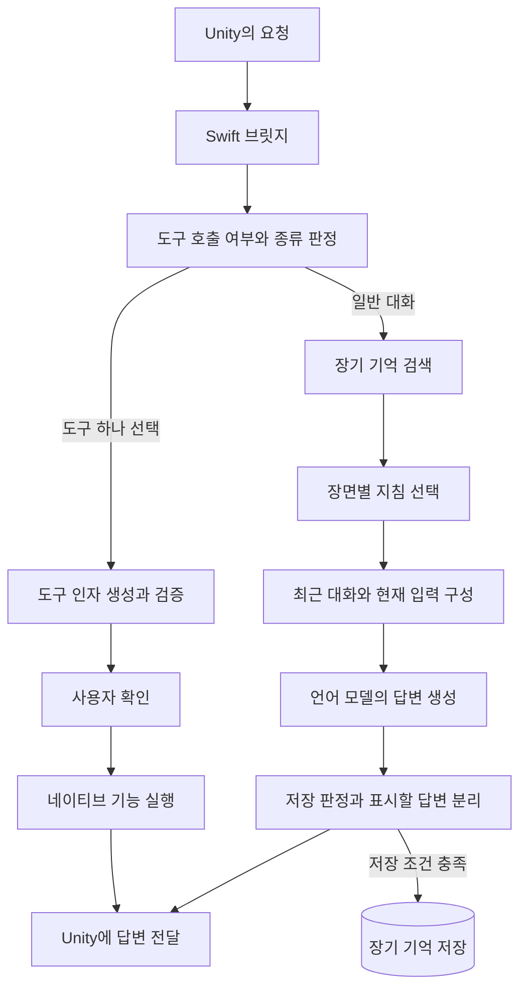

별무리의 AI 코드는 사용자의 입력을 받아 대화 답변을 만들거나 기기 기능의 실행을 제안합니다. Unity가 요청을 보내면 iOS의 Swift 코드가 필요한 처리 순서를 정하고, 기기에 로드된 모델을 호출합니다.

전체 구조를 읽을 때는 요청이 지나가는 순서와 각 구성 요소가 보관하는 상태를 함께 보면 됩니다. 언어 모델, 최근 대화 기록, 장기 기억은 서로 다른 곳에서 관리됩니다.

## Request flow

일반 대화에서는 현재 발화로 관련 기억을 찾고, 발화에 맞는 장면 지침을 고릅니다. Swift는 이 결과와 최근 대화를 언어 모델의 입력으로 구성합니다. 답변은 생성되는 동안 조각 단위로 Unity에 전달됩니다.

도구 경로는 일반 대화 입력을 구성하기 전에 분기합니다. 실행할 도구를 선택한 뒤 언어 모델이 필요한 인자를 제안합니다. Swift가 인자를 검증하고 사용자 확인을 받은 다음 기기 기능을 호출합니다. 여러 도구가 동시에 선택된 경우에는 실행 제안을 만들지 않고 요청을 나누도록 안내합니다.

## Components and state

| 구성 요소 | 맡은 일 | 보관하는 상태 |
| --- | --- | --- |
| Unity 대화 세션 | 입력을 보내고 화면을 갱신합니다. | 현재 요청 식별자와 화면에 표시할 답변을 보관합니다. |
| Swift 브릿지 | 도구 분기, 기억 검색, 입력 구성과 결과 처리를 조율합니다. | 요청 처리 상태와 최근 대화를 보관합니다. |
| 언어 모델 런타임 | 답변 또는 도구 인자를 생성합니다. | 로드된 모델 엔진과 생성에 사용할 대화 객체를 보관합니다. |
| 임베딩 서비스 | 문장을 검색·분류에 쓸 숫자 배열로 바꿉니다. | 준비된 임베딩 모델을 공유합니다. |
| 장기 기억 저장소 | 저장 조건을 통과한 발화와 검색용 벡터를 기록합니다. | SQLite 파일에 기록을 유지합니다. |

현재 장면별 지침을 사용하는 대화 경로는 요청마다 새 대화 객체를 만듭니다. 모델 엔진은 계속 로드해 두고, Swift가 보관한 최근 대화를 새 입력에 다시 넣습니다. 따라서 모델 엔진의 수명과 대화 기록의 수명을 같은 것으로 보면 처리 구조를 잘못 이해할 수 있습니다.

## Unity boundary

Unity는 요청 식별자, 입력과 세션 정보를 JSON으로 전달합니다. C 함수와 Objective-C++ 래퍼가 이 요청을 Swift에 연결합니다. 결과는 콜백으로 돌아오며 Unity 어댑터의 이벤트 큐에 들어갑니다.

Unity는 이벤트의 요청 식별자를 현재 요청과 대조합니다. 이전 요청의 답변 조각이 늦게 도착해도 현재 답변에 붙지 않도록 처리합니다. 모델 준비처럼 특정 요청에 속하지 않는 이벤트는 별도로 취급합니다.

답변 완료와 기억 저장 완료도 구분됩니다. 일반 대화에서는 답변을 완성한 뒤 Unity에 완료 이벤트를 보내고, 이후 저장 대상 발화를 기록합니다. 답변이 화면에 나왔다는 사실만으로 기억 저장까지 성공했다고 판단할 수는 없습니다.
