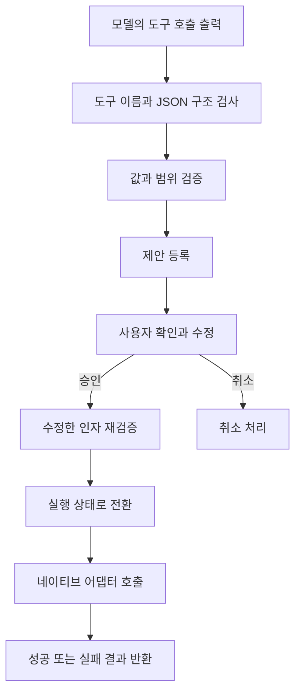

도구를 선택한 뒤에는 실제 실행에 사용할 인자를 만들어야 합니다. 날짜, 시간이나 수량처럼 사용자의 표현을 함수가 받을 수 있는 값으로 바꾸는 단계입니다. 현재 구조에서는 언어 모델의 출력이 제안 객체가 되고, Swift 코드가 이를 확인한 뒤 실행합니다.

## Generation and parsing

선택한 도구의 정의와 전용 지침으로 대화 객체를 만듭니다. 언어 모델 엔진은 일반 대화와 공유하지만, 이 생성에는 선택된 도구 하나의 정의를 제공합니다.

모델이 반환한 호출은 도구 이름과 JSON 인자로 구성됩니다. 파서는 반환한 이름이 라우터가 선택한 도구와 일치하는지 검사합니다. 도구마다 필수 필드와 허용 필드를 확인하고, 값의 자료형도 검사합니다.

JSON을 읽을 수 있다는 것만으로 인자가 유효해지지는 않습니다. 구조가 맞아도 범위를 벗어난 시간이나 종료가 시작보다 이른 기간이 들어올 수 있습니다. 이 검사는 다음 단계에서 수행합니다.

## Argument validation

검증기는 도구별 조건을 적용하고 실행에 사용할 자료형으로 변환합니다. 현재 코드에는 시·분 범위, 날짜의 유효성, 기간의 순서, 일부 예약의 미래 시각 여부, 문자열 길이와 조회 범위 제한 등이 있습니다.

검증 규칙은 도구마다 다릅니다. 예를 들어 알람과 로컬 알림에는 미래 시각 검사가 있고, 일정 생성에는 시작·종료 순서 검사가 있습니다. 모든 시간 관련 도구가 동일한 미래 시각 정책을 사용한다고 일반화하면 안 됩니다.

검증기는 일부 값을 정규화하기도 합니다. 날짜 범위를 네이티브 API에 전달할 때 마지막 날의 다음 날을 상한으로 바꾸거나, 일정의 종료 시각이 없으면 시작에서 한 시간 뒤로 설정하는 처리가 있습니다. 이런 값은 모델이 출력한 원본과 다를 수 있으므로 실제 확인·실행에 사용하는 제안을 기준으로 봐야 합니다.

## Confirmation and execution

처음 검증한 제안은 확인 화면으로 전달됩니다. 사용자가 인자를 수정한 경우에는 수정한 값으로 다시 검증합니다. 승인 이후의 검증이 통과해야 실행 조정자에 전달됩니다.

실행 조정자는 제안 준비, 확인 대기, 실행 중, 완료·취소·실패의 상태를 관리합니다. 확인 대기 상태가 아닌 요청을 실행하려고 하면 거부합니다. 이미 실행을 시작한 요청도 다시 실행하지 않도록 기록합니다.

실행 여부는 네이티브 기능 호출을 기다리기 전에 기록됩니다. 같은 요청을 동시에 승인하는 경우, 비동기 실행이 끝나기 전이라도 두 번째 호출을 거부할 수 있도록 한 구조입니다. 이 상태는 프로세스 메모리에 있으므로 앱 재실행 이후까지 이어지는 실행 보증으로 확대해서 설명하지 않습니다.

## Result handling

네이티브 어댑터는 실행 결과나 오류를 반환합니다. 결과 포맷터는 이 값을 사용자가 읽을 응답으로 바꾸어 Unity에 전달합니다. 현재 경로는 실행 결과를 다시 언어 모델에 넣어 자유롭게 설명하도록 생성하지 않습니다.

도구 응답이 최근 대화에 남는 경로는 있지만, 일반 대화의 장기 기억 검색·저장 절차는 거치지 않습니다. 도구가 성공했다는 상태와 최근 대화에 어떤 내용이 추가되었는지를 구분해서 볼 수 있습니다.

## Remaining verification

모델의 도구 인자 생성 중 취소가 실제 생성 중단으로 이어지는지는 아직 확인되지 않았습니다. 현재 런타임에서 이 생성 경로는 일반 스트리밍과 동일한 취소 추적 필드를 등록하지 않습니다.

운영체제 권한 거부, 확인 화면 취소, 앱 전환과 네이티브 API 실패도 실제 기기에서 확인해야 합니다. 검증된 제안이라는 상태는 운영체제의 실행 성공까지 의미하지 않습니다.
